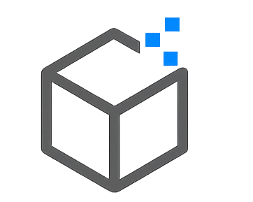

  

# Ali4Concrete – ACI Aggregate Testing Technician Level 1 – Calculator (SI)

**Scope:** T2/D75, T248/C702, T11/C117, T27/C136, T85/C127, T84/C128, T255/C566, T21/C40  
**For:** Zero-programming technicians & students · **Units:** SI (kg, g, mm, °C)

---

## Quick Start
1. Open **`Ali4Concrete_ACI_ATT_L1_Calculator.ipynb`** in Jupyter (Anaconda/VS Code/Colab).  
2. In each section: edit the **📥 Input — Edit here** cell → press **Shift+Enter** → run the **▶ Calculate** cell under it.  
3. Review the **Summary Dashboard** at the end.

> This tool **calculates/records values only**. Always follow the latest **ASTM/AASHTO** procedures during testing.

---

## Included Methods
- **AASHTO T 2 / ASTM D75** — Sampling of Aggregates *(record metadata)*  
- **AASHTO T 248 / ASTM C702** — Reducing to Testing Size *(splits, ratio)*  
- **AASHTO T 11 / ASTM C117** — % Finer than 75 μm by Washing  
- **AASHTO T 27 / ASTM C136** — Sieve Analysis (gradation table, sum≈100±0.3, optional FM)  
- **AASHTO T 85 / ASTM C127** — Coarse Aggregate SG & Absorption  
- **AASHTO T 84 / ASTM C128** — Fine Aggregate SG & Absorption  
- **AASHTO T 255 / ASTM C566** — Moisture Content by Drying  
- **AASHTO T 21 / ASTM C40** — Organic Impurities *(qualitative color record)*

---

---

## 📞 Contact & Links

- **Email:** [ali4.concrete.ai@gmail.com](mailto:ali4.concrete.ai@gmail.com)  
- **WhatsApp:** [+964 771 601 6272](https://wa.me/9647716016272)  
- **YouTube:** [youtube.com/@Ali4Concrete](https://www.youtube.com/@Ali4Concrete)  
- **LinkedIn:** [linkedin.com/in/ali4concrete](https://www.linkedin.com/in/ali4concrete/)  
- **Facebook:** [facebook.com/Ali4Concrete.Official](https://www.facebook.com/Ali4Concrete.Official)

---

© 2025 **Ali4Concrete** — All Rights Reserved  
*Developed by Eng. Ali Abdulameer Mohammed*  
🧱 *Testing · Training · Standards · Technology*

